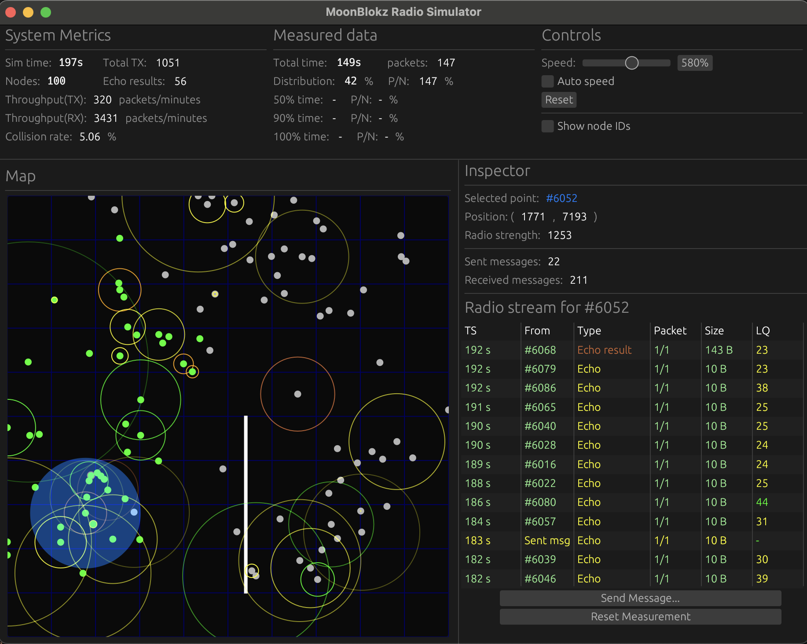

# MoonBlokz Radio Simulator

MoonBlokz is a Decentralized Physical Infrastructure Network (DePIN) system optimized for microcontrollers and radio communication, operating independently of any central infrastructure. [https://www.moonblokz.com](https://www.moonblokz.com).

This application is a cross-platform desktop simulator that runs the exact same embedded codebase used on real MoonBlokz radio nodes. It enables rapid, large-scale testing of the mesh network protocol without requiring physical hardware deployment.

## Why This Simulator?

Testing a mesh network protocol exclusively with physical hardware is extremely challenging. A realistic testbed requires dozens of nodes deployed across different physical locations, and every new experiment demands physically rearranging devices. This is slow, error-prone, and prevents the rapid iteration needed during development.

Full VM-based emulation (e.g., QEMU) offers accuracy but collapses under real-world scale. Running dozens or hundreds of isolated virtual machines introduces massive overhead in resources, speed, and orchestration complexity—slowing development dramatically without providing proportional benefits.

Instead, this simulator adopts a **lightweight multi-node simulation architecture** that runs all nodes inside the same process on a single desktop machine. Each simulated node executes the exact same codebase as the real embedded nodes—including async tasks, bounded queues, deterministic timing logic, and radio-layer behavior. By avoiding OS-level virtualization, the simulator remains extremely fast and memory-efficient, allowing hundreds or even thousands of nodes to run concurrently.

### Key Benefits

- **Rapid iteration**: Test large-scale network behavior without deploying physical hardware
- **Controlled experiments**: Arbitrary topologies, node densities, and radio conditions
- **Simplified debugging**: All logs, traces, and metrics originate from a single coordinated runtime
- **Faithful behavior**: Same code as embedded nodes, preserving timing and protocol semantics
- **Visual feedback**: Real-time visualization is far more effective than reading log output

Comprehensive details about MoonBlokz can be found in the [MoonBlokz article series](https://medium.com/@peter.sallai/moonblokz-series-part-i-building-a-hyper-local-blockchain-2f385b763c65). The simulator is specifically covered in [Part VII/4 — Radio Network Simulation](https://medium.com/moonblokz/moonblokz-series-part-vii-4-radio-network-simulation-5cc86a721e8c).



## Features

### Simulation Capabilities

- **Multi-node execution**: Run hundreds or thousands of nodes in a single process using the same embedded codebase
- **2D visualization**: Although MoonBlokz supports 3D node placement, the simulator uses 2D to keep visualization intuitive while preserving all behaviors relevant to radio networking (distance-based attenuation, collision likelihood, neighborhood formation, relay-score dynamics)
- **Configurable scenes**: Load network configurations from JSON files defining nodes, obstacles, radio parameters, and protocol settings
- **Radio signal simulation**: Log-distance path-loss model with shadowing, SINR calculation, collision detection, and capture effect
- **Obstacle modeling**: Rectangular and circular obstacles that block radio signal propagation
- **Time scaling**: Run simulations at 1-1000% of real-time speed with smooth, continuous clock mapping
- **Auto-speed control**: Automatically adjusts simulation speed based on CPU availability to maximize throughput while maintaining deterministic timing

### User Interface

- **Map visualization**: Node positions, obstacles (walls), and real-time radio signal propagation displayed on a 2D grid
- **Node details**: Per-node breakdown of radio activity (incoming/outgoing packets, collisions, link quality)
- **System metrics**: Real-time network-wide statistics (total packets sent, throughput, collision rate)
- **Measurement mode**: Inject blockchain messages (e.g., `add_block`) and visualize propagation progress across the network (50/90/100% reach times and packets per node)
- **Interactive selection**: Click nodes to inspect their radio stream in real-time
- **Effective range overlay**: Visual indicator of a node's theoretical maximum transmission distance

## Quick start

Prerequisites: a recent Rust toolchain (stable) on macOS/Linux/Windows.

1. Build and run the simulator
    - The app starts with a file picker—select a scene JSON from the `scenes/` folder (e.g., `scenes/example.json`) or your own (see “Scene file format”).
2. Use the top “Controls” panel to adjust simulation speed or enable Auto speed.
3. Click nodes on the map to open the Inspector and view their radio stream.

## UI at a Glance

### Top Panel

- **System Metrics**: Simulation time, total TX/RX, collision rate, node count
- **Measured data**: Distribution %, time-to-50/90/100%, packets-per-node
- **Controls**: Speed slider, Auto speed toggle, Reset speed, Show node IDs
- Three-column layout with labels, fixed-width values, and time-scaling controls

### Right Inspector Panel

- Selected node details and a **virtualized scrollable table** of recent radio events
- Collisions are highlighted; link quality is color-coded by thresholds
- Uses `egui-extras` for efficient rendering—handles row virtualization automatically
- Only visible rows are rendered, enabling smooth performance with thousands of data items
- Fixed-size labels at top, scrollable table in middle, controls at bottom

### Central Map View

- 0..10000 world-units square with grid
- **Node visualization**: Green circles with identifiers
- **Obstacles**: White shapes (rectangles and circles)
- **Selected node**: Semi-transparent blue filled circle
- **Radio transmissions**: Animated colored circles representing outgoing signals
  - Start as small circles with fully opaque stroke
  - Expand to node's effective distance while fading to transparency over one second
  - Provides intuitive visual cue that a packet has been sent
- Click to select nearest node; selected node shows effective range overlay
- Coordinate transformation from scene space to screen space for all rendering

## Scene file format (JSON)

The simulator loads a “Scene” JSON describing the environment and nodes.

- path_loss_parameters
  - path_loss_exponent (f32)
  - shadowing_sigma (f32)
  - path_loss_at_reference_distance (f32)
  - noise_floor (f32)
- lora_parameters
  - bandwidth (u32)
  - spreading_factor (u8)
  - coding_rate (u32) — 1..4 meaning 4/5..4/8
  - preamble_symbols (f32)
  - crc_enabled (bool)
  - low_data_rate_optimization (bool)
- radio_module_config
  - delay_between_tx_packets (u16) - in milliseconds
  - delay_between_tx_messages (u8) - in seconds
  - echo_request_minimal_interval (u16) - in minutes
  - echo_messages_target_interval (u8)
  - echo_gathering_timeout (u8)
  - relay_position_delay (u8)
  - scoring_matrix ([u8; 5])
  - retry_interval_for_missing_packets (u16)
- nodes: array of
  - node_id (u32)
  - position { x: u32, y: u32 } in 0..10000 world units
  - radio_strength (f32) — TX power in dBm used by the path loss model
- obstacles: array of tagged enums
  - Rectangle: { "type": "rectangle", "top-left-position": {x,y}, "bottom-right-position": {x,y} }
  - Circle: { "type": "circle", "center_position": {x,y}, "radius": u32 }
- world_top_left: { x: f64, y: f64 } — Top-left corner of the world coordinate system
- world_bottom_right: { x: f64, y: f64 } — Bottom-right corner of the world coordinate system
- width: f64 — Width of the world in meters
- height: f64 — Height of the world in meters

Minimal example:

```json
{
  "path_loss_parameters": {
    "path_loss_exponent": 2.0,
    "shadowing_sigma": 0.0,
    "path_loss_at_reference_distance": 40.0,
    "noise_floor": -120.0
  },
  "lora_parameters": {
    "bandwidth": 125000,
    "spreading_factor": 7,
    "coding_rate": 1,
    "preamble_symbols": 8.0,
    "crc_enabled": true,
    "low_data_rate_optimization": false
  },
  "radio_module_config": {
    "delay_between_tx_packets": 200,
    "delay_between_tx_messages": 10,
    "echo_request_minimal_interval": 17,
    "echo_messages_target_interval": 50,
    "echo_gathering_timeout": 10,
    "relay_position_delay": 0,
    "scoring_matrix": [255, 243, 65, 82, 143],
    "retry_interval_for_missing_packets": 60
  },
  "nodes": [
    { "node_id": 1, "position": { "x": 1000, "y": 1000 }, "radio_strength": 14.0 },
    { "node_id": 2, "position": { "x": 3000, "y": 2000 }, "radio_strength": 14.0 }
  ],
  "obstacles": [
    { "type": "rectangle", "top-left-position": {"x": 1500, "y": 1500}, "bottom-right-position": {"x": 2500, "y": 2500} },
    { "type": "circle", "center_position": {"x": 5000, "y": 5000}, "radius": 400 }
  ],
  "world_top_left": { "x": 0, "y": 0 },
  "world_bottom_right": { "x": 10000, "y": 10000 },
  "width": 10000,
  "height": 10000
}
```

## Architecture overview

The simulator is composed of four core modules:

- src/main.rs (GUI and app runtime)
  - Builds the egui interface and owns the UI state.
  - Spawns an Embassy executor on a background thread and bridges UI↔network via bounded channels.
- src/network.rs (simulation core)
  - Loads the scene, spawns one async node task per node, and runs the central simulation loop.
  - Maintains per-node message ring buffers and processes CAD/airtime windows.
  - Selects receivers by range and line-of-sight; computes SINR/collisions and delivers RX.
- src/signal_calculations.rs (radio/geometry math)
  - Path loss with log-normal shadowing, RSSI, SNR thresholds, airtime, preamble and CAD durations.
  - Deterministic “effective distance” used for fast range checks and UI overlays.
- src/time_driver.rs (virtual time)
  - Global, scaled embassy-time driver. Preserves virtual-time continuity on speed changes.
  - Slices waits (≤25 ms) and bumps an epoch on updates to keep timers responsive.

Threads and channels:

- UI thread: egui/eframe render loop.
- Embassy executor thread: runs the network task and node tasks.
- UIRefreshChannel (network→UI): alerts, nodes/obstacles updates, counters, pulses, speed updates, node info.
- UICommandChannel (UI→network): load scene, request node info, start measurement, toggle auto-speed.
- Per-node channels: NodeInputQueue (network→node) and NodesOutputQueue (node→network).

## Radio Signal Simulation

### Signal Calculation

The simulator uses the **log-distance path-loss model** to estimate signal strength degradation:

```text
PL(d) = PL(d₀) + 10 × n × log₁₀(d/d₀) + X_σ
```

Where:

- `PL(d₀)`: Path loss at reference distance (1 meter), configured in scene
- `n`: Path loss exponent from scene (typical: 2.0 for free space, 2-4 for urban)
- `d`: Distance between transmitter and receiver (meters)
- `X_σ`: Log-normal shadowing term sampled from Normal(0, σ)

Received signal strength:

```text
packet_rssi = tx_power - PL(d)
```

### Noise and Interference

Because decibels (dBm) use a logarithmic scale, the simulator converts to milliwatts, adds linearly, then converts back:

```text
total_noise = mw_to_dbm(dbm_to_mw(noise_floor) + SUM(dbm_to_mw(other_signal_rssi)))
```

A packet is successfully received if:

```text
packet_rssi - total_noise > snr_limit
```

### Effective Distance

For optimization, the simulator calculates an effective distance—the maximum range at which a receiver can decode a signal under ideal conditions (ignoring shadowing and interference, considering only noise floor). Packets are only processed if the receiver is within the transmitter's effective distance.

### Obstacles

Scenes can include rectangular and circular obstacles that **fully block** radio signals. The simulator checks if the straight line between transmitter and receiver intersects any obstacle. If so, the signal is dropped immediately. This simplified model (no reflections or diffraction) is perfectly acceptable for studying message propagation and collision behavior.

### Collisions and Capture

1. **Transmission**: When a node emits a packet, the simulator enqueues a TX airtime window for the sender and for each in-range, unobstructed receiver.
2. **Reception and SINR**: At the end of a receiver's window, SINR is computed as `RSSI(dBm) - 10·log₁₀(sum_mW(noise_floor + overlapping RSSIs))`. If SINR ≥ SNR limit and not captured, the packet is delivered with link quality.
3. **Capture effect**: Overlaps are tracked; a later-starting packet is destroyed if an earlier, stronger one exceeds a threshold (6 dB), and vice versa for strong later packets. Even if both signals are above the noise floor, real antennas can't decode both simultaneously.

### Simulation Simplifications

The simulator deliberately excludes two complex factors for performance:

1. **Multipath fading**: Real signals bounce off buildings causing interference (Rayleigh fading). The simulator approximates this variance using the simpler Shadowing term (X_σ).
2. **Clock drift**: The simulator uses a perfect global clock. Real nodes experience small timing drift, but this doesn't pose a problem because the MoonBlokz protocol is intentionally designed to operate without relying on any global time source.

**Performance optimizations:**

- Geometry uses squared-distance comparisons in hot paths to avoid sqrt
- Per-node history is a ring buffer (default 1000 entries) to keep memory bounded

## Example Scenes and Results

The simulator includes several example scenes that demonstrate different network behaviors:

### Scene #1: Basic Example

A simple scene with five nodes: four at the corners of a square and one in the center. Each message consists of 10 packets. Because Node #1 cannot reach Node #4 directly, exactly one relay is required—a theoretical minimum of 20 transmitted packets. Nodes correctly detect when all nodes have received the message and avoid unnecessary relaying.

### Scene #2: Planet with Satellites

A circular obstacle (representing a planet) surrounded by two concentric rings of satellites. Inner ring satellites have weaker radios, while outer ring satellites use stronger radios with larger line-of-sight areas. Satellites in the outer ring achieve higher relay scores and tend to dominate the relaying process due to their stronger radios and clearer visibility.

### Scene #3: 100 Random Nodes with Wall

Closer to real-world conditions with 100 randomly placed nodes of varying radio strengths, separated by a wall. Notable behaviors:

- Relaying activity quickly stabilizes in saturated regions, with the "front line" moving outward toward unsaturated areas
- Nodes only relay when doing so would meaningfully increase coverage
- Missing-packet recovery mechanism works correctly: nodes that miss fragments can request and receive them from neighbors

### Scene #4: The Labyrinth

An intentionally structured environment with 300 nodes arranged inside a labyrinth. Key insight: **network saturation time is determined not by the number of nodes, but by the depth of the topology**—the longest relay path. The broadcast propagates in parallel along all corridors, branching at junctions. Once the message reaches the end of the longest path, the entire labyrinth becomes covered shortly after.

This demonstrates how topology, not node count, determines propagation time in environments where obstacles constrain radio waves.

## Performance and limits

- Scaled time driver avoids timer “bursts” after speed changes and reduces stalls via short wait slices.
- Bounded channels and history buffers to prevent unbounded memory growth under heavy load.
- Large executor stack is used to support many simulated nodes on desktop targets.

## Development

### UI Framework

The simulator uses **egui/eframe** for its cross-platform desktop UI. This choice was made after evaluating several options:

- **Why not web-based (Tauri)?** The simulator is a relatively simple tool best kept simple. A desktop-first approach runs locally without deployment steps, integrates seamlessly with file-based logging and configuration, and avoids browser-imposed restrictions.
- **Why egui?** It's a mature library with cross-platform support (macOS, Windows, Linux) and can be compiled to WASM if web deployment is needed later.
- **Immediate Mode UI**: egui is an immediate mode UI library, meaning the application directly issues draw commands for every UI element on every frame, rather than maintaining a persistent widget tree (retained mode). This offers simplicity and eliminates state synchronization boilerplate, making it ideal for prototyping and debug tools. The tradeoff is that the entire scene must be redrawn continuously, but this is manageable for the simulator's relatively simple interface.

### Build and Test

- The crate includes unit tests for time mapping, geometry, and radio timing/math.
- Key conventions
  - World coordinates: 0..10000 meters on both axes; UI maps these to the current viewport.
  - Power units: dBm/mW; time units: embassy::Duration or seconds (math only).

## License

This project is licensed under the terms of the LICENSE file in this repository.
